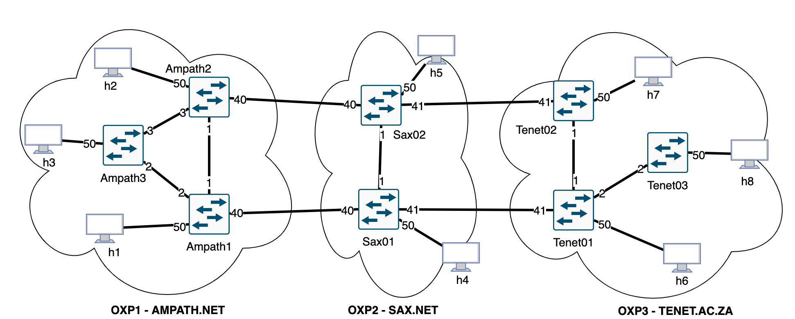

==============================================================
Showcasing network use cases using SDX testbed
===============================================================

Introduction
============

This page demonstrate some network use cases and scenarios using SDX
testbed based on a virtual environment with Mininet and OpenVSwitch.

The topology being used on this setup is the following one:



Pre-requirements
================

In order to run the experiments described on this page, please setup
the SDX testbed on your computer by following the steps described in http://sdx-docs.readthedocs.io/en/latest/sdx_deploy_single_server.html.

In summary, you will need to install Docker in your computer and run the following steps:

.. code-block :: RST

	git clone https://github.com/atlanticwave-sdx/sdx-end-to-end-tests
	cd sdx-end-to-end-tests
	docker compose up -d
	./wait-mininet-ready.sh
	./scripts/run-mininet-interactive.sh

Use Case 1: Intra-domain link up/down
=====================================

In this scenario, we will demostrante intra-domain link going DOWN and UP. Then we will evaluate how SDX-Controller will behave and manage existing services. Intra-domain connectivy should be handled by OXP, so SDX-Controller should not change existing L2VPNs with those network events.

Please consider the topology displayed below. We will assume there two L2VPN services provisioned between different endpoints on the topology: L2VPN "red" between port 50 at Ampath3/OXP1 (h3) and port 50 at Sax01/OXP2 (h4); and L2VPN "green" between port 50 at Ampath1/OXP1 (h1) and port 50 at Ampath2/OXP1 (h2). Then we will simulate two intra-domain link failures as highlighted in orange: 1) link Ampath1-Ampath3 and 2) link Ampath1-Ampaht2.

.. image:: ./media/sdx-single3oxps-usecase1.png

A) We will first create the L2VPNs:

.. code-block :: RST

	docker compose exec -it mininet curl -s -X POST -H 'Content-type: application/json' http://sdx-controller:8080/SDX-Controller/l2vpn/1.0 -d '{"name": "L2VPN-red", "endpoints": [{"port_id": "urn:sdx:port:ampath.net:Ampath3:50", "vlan": "101"}, {"port_id": "urn:sdx:port:sax.net:Sax01:50", "vlan": "101"}]}'
	
	docker compose exec -it mininet curl -s -X POST -H 'Content-type: application/json' http://sdx-controller:8080/SDX-Controller/l2vpn/1.0 -d '{"name": "L2VPN-green", "endpoints": [{"port_id": "urn:sdx:port:ampath.net:Ampath1:50", "vlan": "102"}, {"port_id": "urn:sdx:port:ampath.net:Ampath2:50", "vlan": "102"}]}'

B) Let's check the L2VPN status and current path

.. code-block :: RST

	# Get L2VPN ID, Name and Status
	docker compose exec -it mininet curl -s http://sdx-controller:8080/SDX-Controller/l2vpn/1.0 | jq -r '.[]|.service_id + " " + .status + " " + .name '
	
	# Get the current path (change the Service ID accordingly to prev step):
	RED=73c38571-9252-4045-9c55-3005861ee28f
	docker compose exec -it mininet curl -s http://sdx-controller:8080/SDX-Controller/l2vpn/1.0/$RED | jq -r '.[].current_path'
	GREEN=a7a35c8e-a641-4d5a-97c2-28357c9854be
	docker compose exec -it mininet curl -s http://sdx-controller:8080/SDX-Controller/l2vpn/1.0/$GREEN | jq -r '.[].current_path'

C) Let's now configure the hosts with proper VLAN and test connectivity:

.. code-block :: RST

	./scripts/test-l2vpn.sh $RED
	
	./scripts/test-l2vpn.sh $GREEN

D) Let's simulate a NNI port Down, test connectivity again and check L2VPN status. Let's start with Ampath1-Ampath3:

.. code-block :: RST

	docker compose exec -it mininet ip link set down Ampath1-eth2
	
	./scripts/test-l2vpn.sh $RED
	
	./scripts/test-l2vpn.sh $GREEN
	
	./scripts/show-sdx-controller.sh l2vpn
	
	./scripts/show-sdx-controller.sh links

Then, let's simulate a failure on Ampath1-Ampath2 intra-domain link and check again:

.. code-block :: RST

	docker compose exec -it mininet ip link set down Ampath1-eth1
	
	./scripts/test-l2vpn.sh $RED
	
	./scripts/test-l2vpn.sh $GREEN
	
	./scripts/show-sdx-controller.sh l2vpn
	
	./scripts/show-sdx-controller.sh links

Notice that both L2VPN are failing on the connectivity test but they are reporting status UP, this is expected due to the lack of the BAPM SDX component.

E) Let's simulate port UP, test connectivity again and check L2VPN status

.. code-block :: RST

	docker compose exec -it mininet ip link set up Ampath1-eth2
	
	./scripts/test-l2vpn.sh $RED
	
	./scripts/test-l2vpn.sh $GREEN
	
	docker compose exec -it mininet ip link set up Ampath1-eth1
	
	./scripts/test-l2vpn.sh $RED
	
	./scripts/test-l2vpn.sh $GREEN
	
	./scripts/show-sdx-controller.sh l2vpn
	
	./scripts/show-sdx-controller.sh links

F) Let's remove the L2VPN

.. code-block :: RST

	docker compose exec -it mininet curl -s -X DELETE http://sdx-controller:8080/SDX-Controller/l2vpn/1.0/$RED
	docker compose exec -it mininet curl -s -X DELETE http://sdx-controller:8080/SDX-Controller/l2vpn/1.0/$GREEN


Use Case 2: UNI port up and down
=================================

In this scenario, we will demostrante a user port (UNI, User-to-Network Interface) going DOWN and UP. Then we will evaluate how SDX-Controller will behave and manage services using that port.

We will create a L2VPN service provisioned between port 50 at Ampath3/OXP1 (host `h3`) and port 50 at Tenet03/OXP3 (host `h8`), and then we will simulate a link down on port 50 at Ampath3. The topology below ilustrate this scenario.

.. image:: ./media/sdx-single3oxps-usecase2.png

A) We will first create the L2VPN:

.. code-block :: RST

	docker compose exec -it mininet curl -s -X POST -H 'Content-type: application/json' http://sdx-controller:8080/SDX-Controller/l2vpn/1.0 -d '{"name": "L2VPN-use-case2", "endpoints": [{"port_id": "urn:sdx:port:ampath.net:Ampath3:50", "vlan": "201"}, {"port_id": "urn:sdx:port:tenet.ac.za:Tenet03:50", "vlan": "201"}]}'

B) Let's check the L2VPN status and current path


.. code-block :: RST
	./scripts/show-sdx-controller.sh l2vpn
	
	ID=a52ec767-dd0e-44ed-9071-1e06a914ea9c
	./scripts/show-sdx-controller.sh l2vpn $ID

C) Let's now configure the hosts with proper VLAN and test connectivity:

.. code-block :: RST

	./scripts/test-l2vpn.sh $ID

D) Let's simulate a UNI port Down, test connectivity again and check L2VPN status

.. code-block :: RST
	docker compose exec -it mininet ip link set down Ampath3-eth50
	
	./scripts/test-l2vpn.sh $ID
	
	./scripts/show-sdx-controller.sh l2vpn
	
	./scripts/show-sdx-controller.sh ports

E) Let's simulate a UNI port UP, test connectivity again and check L2VPN status

.. code-block :: RST

	docker compose exec -it mininet ip link set up Ampath3-eth50
	
	./scripts/test-l2vpn.sh $ID
	
	./scripts/show-sdx-controller.sh l2vpn
	
	./scripts/show-sdx-controller.sh ports

Let's check for any error or exception on the SDX-Controller logs:
```
.. code-block :: RST
docker compose logs -t sdx-controller | egrep -i "error|except"
```

F) Let's remove the L2VPN
```
.. code-block :: RST
docker compose exec -it mininet curl -s -X DELETE http://sdx-controller:8080/SDX-Controller/l2vpn/1.0/$ID
./scripts/show-sdx-controller.sh l2vpn
```

Use Case 3: Inter-domain port down and up
=========================================

In this scenario, we will demostrante a backbone port (NNI, Network-to-Network Interface) going DOWN and UP. Then we will evaluate how SDX-Controller will behave and manage services passing through that port.

We will assume a topology and scenario similar to Use Case 2, however we will now simulate link down events on the backbone ports. Check the topology below with link failures ilustrated in red/blue/green arrows. SDX-Controller will try to find new paths to reprovision the L2VPN until no alternative is found, which will then result in a L2VPN status down. Then we will simulate the ports being recovered and evaluate the SDX-Controller behavior.

.. image:: ./media/sdx-single3oxps-usecase3.png

A) Create the L2VPN, test connectivity and check the current path
```
.. code-block :: RST
docker compose exec -it mininet curl -s -X POST -H 'Content-type: application/json' http://sdx-controller:8080/SDX-Controller/l2vpn/1.0 -d '{"name": "L2VPN-use-case3", "endpoints": [{"port_id": "urn:sdx:port:ampath.net:Ampath3:50", "vlan": "301"}, {"port_id": "urn:sdx:port:tenet.ac.za:Tenet03:50", "vlan": "301"}]}'

./scripts/show-sdx-controller.sh l2vpn

ID=524bb3c2-e651-404e-95b3-68d7e501b23c
./scripts/show-sdx-controller.sh l2vpn $ID

./scripts/test-l2vpn.sh $ID
```

B) Let's simulate the first link down and check the connectivity and current path. For this test we will need two terminals: one we will leave the PING test running and the second we will continue to execute our commands:

Terminal one:
```
.. code-block :: RST
./scripts/test-l2vpn.sh $ID ping-only
```

Terminal two:
```
.. code-block :: RST
docker compose exec -it mininet ip link set down Ampath1-eth40

./scripts/show-sdx-controller.sh l2vpn $ID
```

C) Let's simulate the second link down and check the connectivity and current path
```
.. code-block :: RST
docker compose exec -it mininet ip link set down Tenet01-eth41

./scripts/show-sdx-controller.sh l2vpn $ID
```

D) Let's simulate the third link down and check the L2VPN status
```
.. code-block :: RST
docker compose exec -it mininet ip link set down Sax02-eth41

./scripts/show-sdx-controller.sh l2vpn $ID
```

E) Let's simulate the link up on the last port, test connectivity again and check L2VPN status
```
.. code-block :: RST
docker compose exec -it mininet ip link set up Sax02-eth41

./scripts/show-sdx-controller.sh l2vpn $ID
```

F) Let's simulate the link up on the other ports, and check the L2VPN status
```
.. code-block :: RST
docker compose exec -it mininet ip link set up Ampath1-eth40
docker compose exec -it mininet ip link set up Tenet01-eth41

./scripts/show-sdx-controller.sh l2vpn $ID

./scripts/show-sdx-controller.sh links
```

G) Let's remove the L2VPN
```
.. code-block :: RST
docker compose exec -it mininet curl -s -X DELETE http://sdx-controller:8080/SDX-Controller/l2vpn/1.0/$ID
```

Use Case 4: OXP failed to install L2VPN
=========================================

In this scenario we will simulate a failure to provision the L2VPN in one of the OXPs and evaluate how the SDX-Controller will behave. When an user request a L2VPN from SDX-Controller, that request may be converted into many breakdown L2VPN requests into different OXPs to fulfill user request end-to-end. In distributed and multi-domain systems failures can happen, and we will check how SDX-Controller handle those failures.

We will create a L2VPN service provisioned between port 50 at Ampath3/OXP1 (host `h3`) and port 50 at Tenet03/OXP3 (host `h8`), and then we will simulate a link down on port 50 at Ampath3. Then we will introduce a failure into OXP3 on purpose to evaluate the SDX-Controller behavior.

A) Edit the OXP3 Orchestrator to introduce a failure on purpose for L2VPN of interest (we will use the criteria of VLAN being 777 as a way to differentiate that L2VPN of interest):
```
.. code-block :: RST
docker compose exec -it tenet bash
source /sdx-end-to-end-tests/env/tenet.env
cd /src/kytos-sdx/
git apply <<EOF
diff --git a/main.py b/main.py
index 3c2cacb..4d2869e 100644
--- a/main.py
+++ b/main.py
@@ -703,6 +703,9 @@ class Main(KytosNApp):  # pylint: disable=R0904
             else:
                 evc_dict[attr] = content[attr]

+        if evc_dict["uni_a"].get("tag", {}).get("value") == 777:
+            raise ValueError("error on purpose")
+
         try:
             response = requests.post(KYTOS_EVC_URL, json=evc_dict, timeout=30)
             assert response.status_code == 201, response.text
EOF
pkill -9 kytosd
rm -f /var/run/kytos/kytosd.pid
kytosd --database mongodb
tail /var/log/syslog
exit
```

B) Create the L2VPN that triggers the failure above
```
.. code-block :: RST
docker compose exec -it mininet curl -s -X POST -H 'Content-type: application/json' http://sdx-controller:8080/SDX-Controller/l2vpn/1.0 -d '{"name": "L2VPN-use-case4", "endpoints": [{"port_id": "urn:sdx:port:tenet.ac.za:Tenet03:50", "vlan": "777"}, {"port_id": "urn:sdx:port:ampath.net:Ampath3:50", "vlan": "777"}]}'
```

C) Check the status of the L2VPN
```
.. code-block :: RST
./scripts/show-sdx-controller.sh l2vpn
```

D) Check the L2VPNs created into each OXP (breakdowns):
```
.. code-block :: RST
for OXP in ampath sax tenet; do echo "=> $OXP"; docker compose exec -it mininet curl -s -X GET http://$OXP:8181/api/kytos/mef_eline/v2/evc/ | jq -r '.[]|.id + " " + .status + " " + .name'; done
```

E) Remove the L2VPN
```
.. code-block :: RST
ID=986fae5e-e346-4270-82d0-3eb40e280c91
docker compose exec -it mininet curl -s -X DELETE http://sdx-controller:8080/SDX-Controller/l2vpn/1.0/$ID
```

Use Case 5: restart SDX-Controller
==================================

In this scenario we will restart the SDX-Controller and evaluate if all its services will remain operational and consistent.

A) Create a L2VPN (with bandwidth qos requirements), check status and test connectivity
```
.. code-block :: RST
docker compose exec -it mininet curl -s -X POST -H 'Content-type: application/json' http://sdx-controller:8080/SDX-Controller/l2vpn/1.0 -d '{"name": "L2VPN-use-case5-1", "endpoints": [{"port_id": "urn:sdx:port:ampath.net:Ampath3:50", "vlan": "any"}, {"port_id": "urn:sdx:port:tenet.ac.za:Tenet01:50", "vlan": "any"}], "qos_metrics": {"min_bw": {"value": 8, "strict": true}}}'

./scripts/show-sdx-controller.sh l2vpn

ID=6b061326-53e0-4fa0-af6c-cd3421b8fb0a
./scripts/test-l2vpn.sh $ID
```

B) Force SDX-Controller to restart
```
.. code-block :: RST
docker compose up -d sdx-controller --force-recreate

docker compose logs sdx-controller -t -n 100
```

C) Check the topology, L2VPNs and test connectivity
```
.. code-block :: RST
./scripts/show-sdx-controller.sh nodes

./scripts/show-sdx-controller.sh links

./scripts/show-sdx-controller.sh l2vpn

./scripts/test-l2vpn.sh $ID
```

D) Create another L2VPN (with bandwidth qos requirements)
```
.. code-block :: RST
docker compose exec -it mininet curl -s -X POST -H 'Content-type: application/json' http://sdx-controller:8080/SDX-Controller/l2vpn/1.0 -d '{"name": "L2VPN-use-case5-2", "endpoints": [{"port_id": "urn:sdx:port:ampath.net:Ampath3:50", "vlan": "any"}, {"port_id": "urn:sdx:port:tenet.ac.za:Tenet01:50", "vlan": "any"}], "qos_metrics": {"min_bw": {"value": 8, "strict": true}}}'

./scripts/show-sdx-controller.sh l2vpn
```

E) Create another L2VPN (exceeding available BW)
```
.. code-block :: RST
docker compose exec -it mininet curl -s -X POST -H 'Content-type: application/json' http://sdx-controller:8080/SDX-Controller/l2vpn/1.0 -d '{"name": "L2VPN-use-case5-3", "endpoints": [{"port_id": "urn:sdx:port:ampath.net:Ampath3:50", "vlan": "any"}, {"port_id": "urn:sdx:port:tenet.ac.za:Tenet01:50", "vlan": "any"}], "qos_metrics": {"min_bw": {"value": 8, "strict": true}}}'

./scripts/show-sdx-controller.sh l2vpn
```

F) Remove all existing L2VPNs
```
.. code-block :: RST
for ID in $(docker compose exec -it mininet curl -s http://sdx-controller:8080/SDX-Controller/l2vpn/1.0 | jq -r '.[].service_id'); do docker compose exec -it mininet curl -s -X DELETE http://sdx-controller:8080/SDX-Controller/l2vpn/1.0/$ID; done
```

Use Case 6: Simulate failures on SDX components at the OXP
==========================================================

In this scenario we will simulate a failure on SDX-LC in one of the OXPs and evaluate the SDX-Controller behavior.

A) Disable SDX-LC at OXP3
```
.. code-block :: RST
docker compose down tenet-lc
```

B) Check the topology
```
.. code-block :: RST
./scripts/show-sdx-controller.sh nodes

./scripts/show-sdx-controller.sh links
```

C) Create a L2VPN between Tenet03:50 and Ampath3:50 any VLANs
```
.. code-block :: RST
docker compose exec -it mininet curl -s -X POST -H 'Content-type: application/json' http://sdx-controller:8080/SDX-Controller/l2vpn/1.0 -d '{"name": "L2VPN-use-case6", "endpoints": [{"port_id": "urn:sdx:port:ampath.net:Ampath3:50", "vlan": "any"}, {"port_id": "urn:sdx:port:tenet.ac.za:Tenet01:50", "vlan": "any"}]}'
```

D) Check the L2VPN status, OXPs breakdowns
```
.. code-block :: RST
./scripts/show-sdx-controller.sh l2vpn

for OXP in ampath sax tenet; do echo "=> $OXP"; docker compose exec -it mininet curl -s -X GET http://$OXP:8181/api/kytos/mef_eline/v2/evc/ | jq -r '.[]|.id + " " + .status + " " + .name'; done
```

E) Start the SDX-LC at OXP3
```
.. code-block :: RST
docker compose up tenet-lc -d

docker compose logs tenet-lc -t -n 100
```

F) Check the L2VPN status
```
.. code-block :: RST
./scripts/show-sdx-controller.sh l2vpn
```

G) Remove the L2VPN
```
.. code-block :: RST
for ID in $(docker compose exec -it mininet curl -s http://sdx-controller:8080/SDX-Controller/l2vpn/1.0 | jq -r '.[].service_id'); do docker compose exec -it mininet curl -s -X DELETE http://sdx-controller:8080/SDX-Controller/l2vpn/1.0/$ID; done
```
