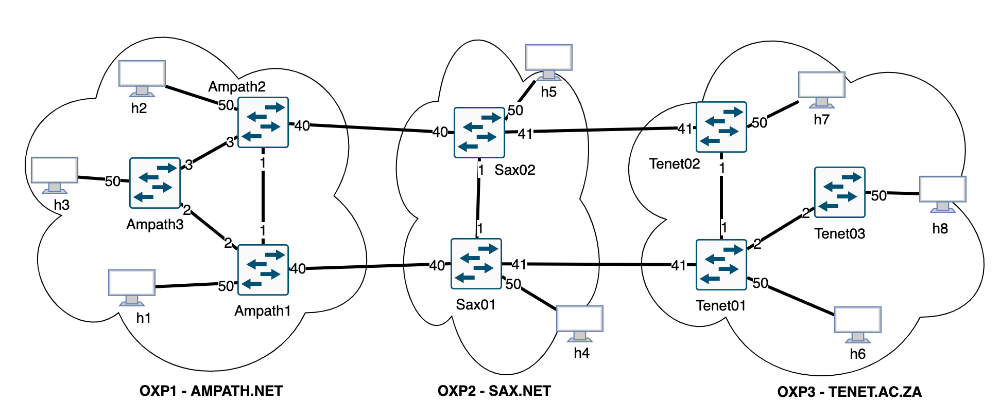

===============================================================
Deploying AtlanticWave-SDX into single server with Docker
===============================================================

Introduction
************

This page list the steps necessary for building the AW-SDX whole environment
into a single server, using Docker and Docker-compose.

On the step-by-step below we will leverage the repo sdx-continuous-development
as the base for the deployment process, just because it already provides
a docker compose file, template env file, and some useful scripts.

All build process will be based on **main** branches (note that we even
ignore the submodules and force cloning from main branch).

The topology being used on this setup is the following one:

Pre-requirements
****************

In order to be able to run this step-by-step, you need to have Docker already
installed on your server, as well as git. Installing docker and git is out of
the scope of this procedure. For docker, we recommend the official documentation:
https://docs.docker.com/engine/install/debian/

Deploying AW-SDX
****************

In order to deploy AW-SDX you have two options: 1) using the end-to-end tests environment in interactive mode; 2) using the standard deployment strategy. Using the end-to-end approach is much easier and fast, while the CI/CD method gives you more control on the setup.

1. Deploy SDX using end-to-end repo
===================================

The procedure is quite straigh-forward and utilizes the published Docker images:

.. code-block :: RST

	git clone https://github.com/atlanticwave-sdx/sdx-end-to-end-tests
	cd sdx-end-to-end-tests
	docker compose up -d
	./wait-mininet-ready.sh
	./scripts/run-mininet-interactive.sh

2. Deploy SDX using the CI/CD repo
==================================

1. First step is to clone the sdx-continuous-development:

.. code-block :: RST

	git clone https://github.com/atlanticwave-sdx/sdx-continuous-development
	cd sdx-continuous-development/data-plane
	git checkout main
	git pull

2. Next step will be to use the template env file to be our actual `.env` file:

.. code-block :: RST

	cp template.env .env

3. Now it is time to build the containers that will be used to setup the environment:

.. code-block :: RST

	for repo in sdx-lc sdx-controller kytos-sdx; do git -C $repo pull || git clone https://github.com/atlanticwave-sdx/$repo; cd $repo/; docker build -t $repo .; cd ..; done

4. Now we can finally bring the environment UP, by running:

.. code-block :: RST

	docker compose up -d

At this point all the components are booting up, which should take a few seconds. You can keep track of what is going on by running `docker compose logs -f`

5. Wait a couple of secunds to make the OXPs boot up. You can use the following steps to make sure they are all UP. The steps below basically queries for the OXPs to make sure all the expected switches are connected:

.. code-block :: RST

	EXP_SW=3; while true; do N_SW=$(curl -s http://0.0.0.0:8181/api/kytos/topology/v3/switches | jq -r '.switches[].id' | wc -l); echo "waiting switches $N_SW / $EXP_SW"; if [ $N_SW -eq $EXP_SW ]; then break; fi; sleep 1; done
	EXP_SW=2; while true; do N_SW=$(curl -s http://0.0.0.0:8282/api/kytos/topology/v3/switches | jq -r '.switches[].id' | wc -l); echo "waiting switches $N_SW / $EXP_SW"; if [ $N_SW -eq $EXP_SW ]; then break; fi; sleep 1; done
	EXP_SW=3; while true; do N_SW=$(curl -s http://0.0.0.0:8383/api/kytos/topology/v3/switches | jq -r '.switches[].id' | wc -l); echo "waiting switches $N_SW / $EXP_SW"; if [ $N_SW -eq $EXP_SW ]; then break; fi; sleep 1; done

6. Configure OXPs. Kytos requires some initial configs like approving switches and links that were just discovered. Run the following script to make the initial configs on all three OXPs:

.. code-block :: RST

	./scripts/curl/2.enable_all.sh

7. At this point the SDX-LC will pull the topology from OXPO (Kytos-ng) periodically. You can force the OXPO to push the topology to SDX-LC by running the following command:

.. code-block :: RST

	for oxp in 8181 8282 8383; do echo $oxp; curl -s -X POST http://127.0.0.1:$oxp/api/kytos/sdx/topology/2.0.0; done

8. The next step will be bringing SDX-Meican UP and integrate it with SDX-Controller. To do that, execute the following steps:

.. code-block :: RST

	cd ~
	git clone https://github.com/atlanticwave-sdx/sdx-meican
	cd sdx-meican

9. Adjust some configs on Meican's `.env` file to comply with your environment:

.. code-block :: RST

	vim .env

Some of the parameters you might want to change:

- **ORCID_CLIENT_ID**: Client ID and Client Secret must be obtained from ORCID (following the instructions in https://info.orcid.org/documentation/api-tutorials/api-tutorial-get-and-authenticated-orcid-id/). Example: `APP-S7XXXXXXXXXXXXXX`
- **ORCID_CLIENT_SECRET**: same here, this have to be obtained from ORCID. Example: `bbxxxxxx-9x0x-4xx1-xxxx-xxxxxxxxxxxxxx`
- **MEICAN_HOST**:  This will be the IP address of the meican host, or DNS. Typically, you can insert here the IP address of the host where you are running docker. You can use a IP address but using the DNS name makes it easy for ORCID registration, where you have to provide the URL (IP address can change, while DNS name will remain the same). Example: `192.168.56.101`
- **SDX_CONTROLLER_URL**: This will be the URL of the SDX-Controller. Since we are running everything on the same machine, you just provide here the IP address of the host where docker is running formated to the sdx-controller URL. Example: `http://192.168.56.101:8080/SDX-Controller/1.0.0/`

10. Build Meican:

.. code-block :: RST

	docker compose -f docker-compose.yml -f docker-compose.dev.yml up -d --build

Testing
*******

- Check if the topology is correctly identified by SDX-Controller:

.. code-block :: RST

	curl -s http://0.0.0.0:8080/SDX-Controller/topology | jq -r '.nodes[] | (.ports[] | .id)'
	curl -s http://0.0.0.0:8080/SDX-Controller/topology | jq -r '.links[] | .id + " " + .ports[0] + " " + .ports[1]'

- Try to create a connection creation request to SDX-Controller which should span requests to all other OXPs:

.. code-block :: RST

	curl -s -X POST -H 'Content-type: application/json' http://0.0.0.0:8080/SDX-Controller/l2vpn/1.0 -d '{"name": "VLAN between AMPATH/300 and TENET/300", "endpoints": [{"port_id": "urn:sdx:port:ampath.net:Ampath3:50", "vlan": "300"}, {"port_id": "urn:sdx:port:tenet.ac.za:Tenet03:50", "vlan": "300"}]}'

- Check if the connection was created on each OXP:

.. code-block :: RST

	curl -s http://0.0.0.0:8181/api/kytos/mef_eline/v2/evc/ | jq -r '.[] | .id + " active=" + (.active|tostring) + " uni_a=" + (.uni_a|tostring) + " uni_z=" + (.uni_z|tostring)'
	curl -s http://0.0.0.0:8282/api/kytos/mef_eline/v2/evc/ | jq -r '.[] | .id + " active=" + (.active|tostring) + " uni_a=" + (.uni_a|tostring) + " uni_z=" + (.uni_z|tostring)'
	curl -s http://0.0.0.0:8383/api/kytos/mef_eline/v2/evc/ | jq -r '.[] | .id + " active=" + (.active|tostring) + " uni_a=" + (.uni_a|tostring) + " uni_z=" + (.uni_z|tostring)'

- Login into Meican and try to create a connection
