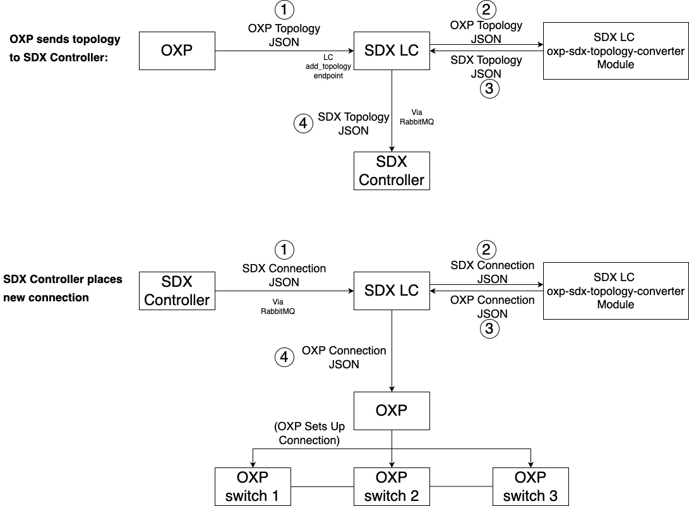

SDX-LC and OXP Integration
==========================

SDX-LC Rest APIs
^^^^^^^^^^^^^^^^

Keep it generic and not depend on OXPs. The current version has
following implemented

a. End points and data model schema defined in swagger.yaml

   i.   /topology : for OXP to publish and update the topology

        1. post

        2. put

   ii.  /connection: for SDX-LC to send service request to the OXP

        1. post

        2. put

   iii. /link: for OXP to update link state

        1. post

        2. put

   iv.  /node: for OXP to update node state

        1. post

        2. put

b. End point backend processing: implemented in the controller functions

   i.   receive the json from OXPs

   ii.  calling OXP API endpoint for connection request

   iii. embedded swagger validation against the data model schema

   iv.  controller: (2.1) DB update (2.2) RabbitMQ publishing

SDX data model
^^^^^^^^^^^^^^

The data model suite is defined and developed in order to communicate
with different OXPs. Internally, SDX middleware does not need it and
uses a graph representation for path computation and other provisioning,
healing, and other autonomous functions.

Ideally we will work with OXPs to find the common ground to support it.
As a matter of fact, it is currently defined with a minimum set of
attributes for network functions. It is modular and each module comes
with associated construction, parsing, and validation functions in the
DataModel repo.

The OXP could provide their current topology description and update
mechanism with corresponding syntax and semantic definitions. And we
could use different mechanism to integrate as specified in the next
section

OXP Site Software and SDX Integration
^^^^^^^^^^^^^^^^^^^^^^^^^^^^^^^^^^^^^

   We can use one of the following three integration mechanisms. The
   deployment of the involving software components on the OXP site
   should be orchestrated by the docker-compose. Per-OXP specific
   configuration and functions should be customized in the site
   configuration file, for example, in the docker-compose file, so that
   no hard-coding or over-generalization is needed.

a. Option 1: Kytos netapp supports SDX data model schema

b. Option 2: OXP does not support SDX data model schema

   i. Sdx-lc controller calls the plugin SDX data model conversion
         function specified in the configuration file.

c. Option 3: OXP provides a static topology description file following
      the SDX data model schema. LC will read it at the startup.

For the common interest. We can take the second approach (yellow). We
add a separate module inside sdx-lc, to be named as
“oxp-sdx-topology-converter”. This module will be responsible for
validating if the topology is a correct OXP topology, and convert into
SDX topology.

In this case, when new connection is sent, LC will take the OXP (Kytos,
OESS, …) topology json on the add_topology API, then call the
oxp-sdx-topology-converter to translate into SDX compatible topology;

When a connection request reaches SDX controller, SDX controller breaks
down the connection, sends connection breakdown from SDX controller to
LC. LC will call the oxp-sdx-topology-converter to translate into OXP
connection, and send to OXP's API.

Here’s a diagram that illustrates the process:

(It’s inside [AtlanticWave-SDX2.0/Design Documents] folder. Feel free to
edit)

The code structure can look like this:

sdx-lc/swagger_server/controllers/

oxp-sdx-topology-converter/

jobs/

messaging/

... ...

The oxp-sdx-topology-converter will be on the same level with
controllers, jobs, etc. This can minimize the changes to the existing LC
endpoints. We only need to add a few lines in topology_controller.py, to
convert OXP topology to SDX topology. Code here:

https://github.com/atlanticwave-sdx/sdx-lc/blob/d6fa0fd9185d1bc50a64bb06e2efcb8cafb0e3c4/swagger_server/controllers/topology_controller.py#L62

and in messaging/topic_queue_consumer.py to convert SDX connection to
OXP connection. Code here:
https://github.com/atlanticwave-sdx/sdx-lc/blob/d6fa0fd9185d1bc50a64bb06e2efcb8cafb0e3c4/swagger_server/messaging/topic_queue_consumer.py#L90
