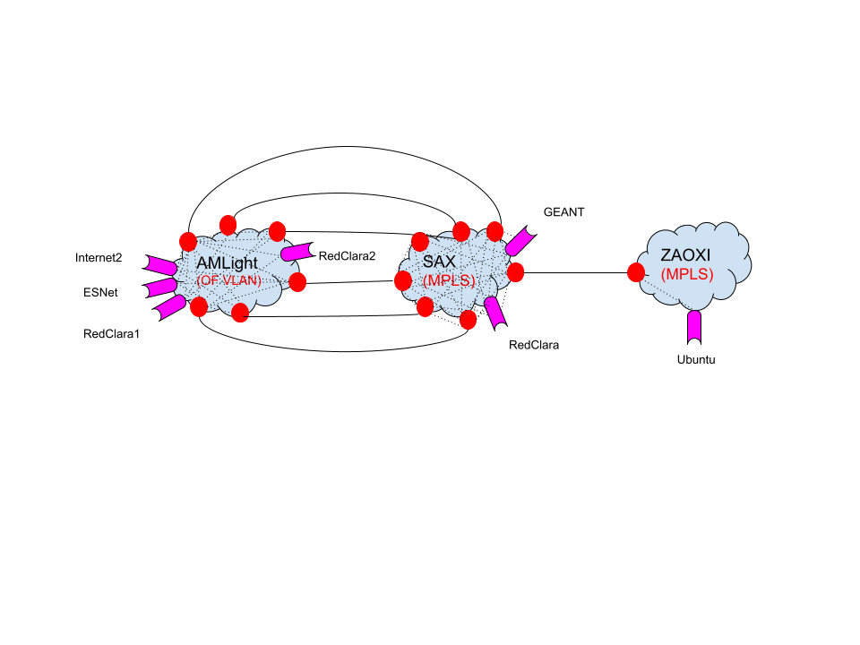
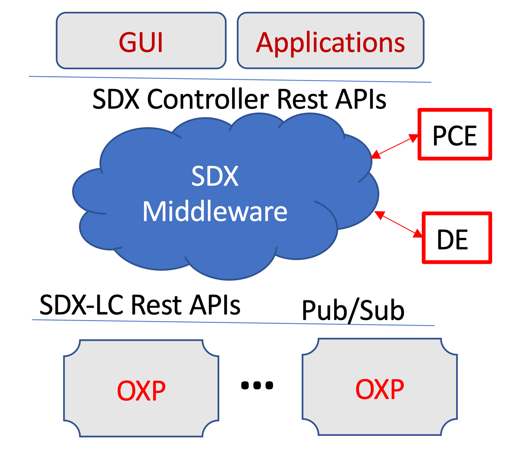
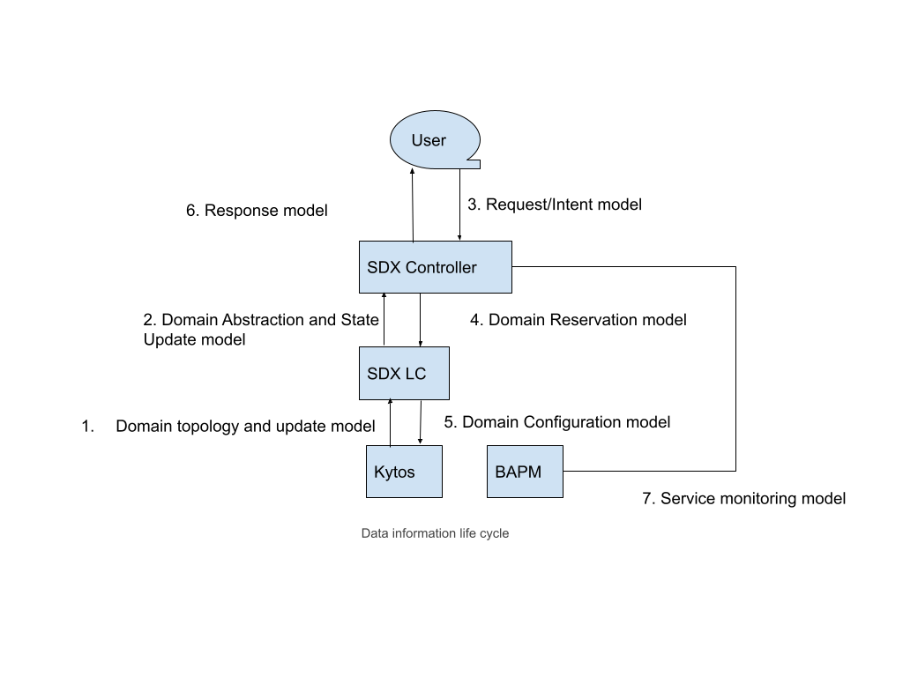
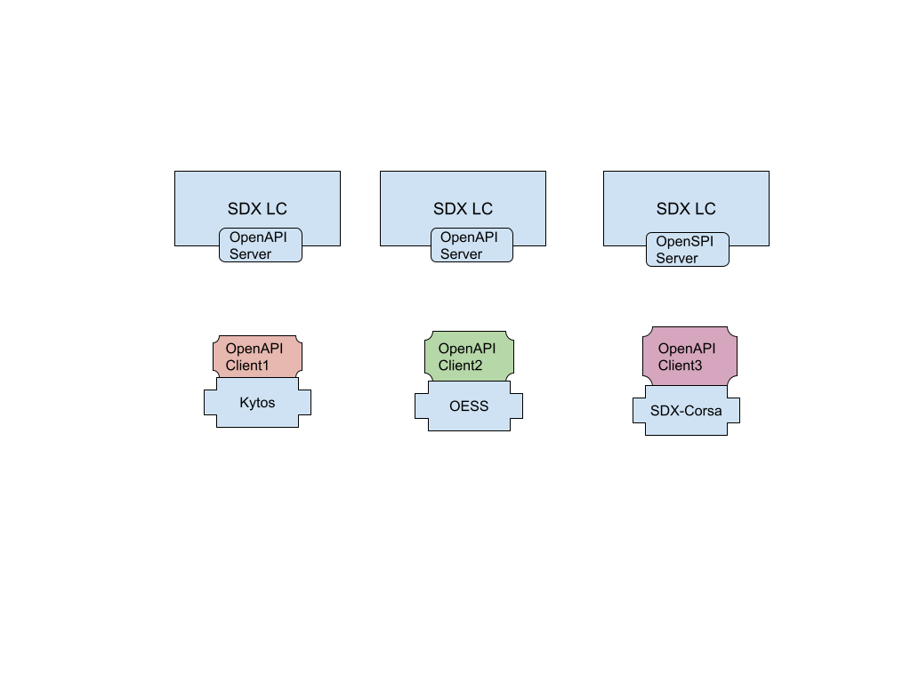

SDX Software System Design
==========================

Three Planes: Data plane, Control plane, and monitoring plane

Data plane
~~~~~~~~~~

1.1 How to abstract the AmLight Interdomain topology?

2. .. rubric:: SDX 2.0 architecture and implementation
      :name: sdx-2.0-architecture-and-implementation

   a. .. rubric:: A service-oriented modular design where different
         subsystems (1) only communicate with each other via RestAPIs
         and Message Queue; (2) will be developed independently.
         :name: a-service-oriented-modular-design-where-different-subsystems-1-only-communicate-with-each-other-via-restapis-and-message-queue-2-will-be-developed-independently.

Detailed System Architecture based on OpenAPI and Pub-Sub
~~~~~~~~~~~~~~~~~~~~~~~~~~~~~~~~~~~~~~~~~~~~~~~~~~~~~~~~~

   .. image:: media/detailed-system.png

c. .. rubric:: Four thrusts
      :name: four-thrusts

   i.  .. rubric:: Inter-domain controller, local controller, Kytos, and
          BAPM communication architecture: Open API (III) + RabitMQ
          Pub-sub (IV)
          :name: inter-domain-controller-local-controller-kytos-and-bapm-communication-architecture-open-api-iii-rabitmq-pub-sub-iv

       1. Domain joining and topology updates: adding/deleting node(s)
          or link(s), the version will increase by 1. This is via LC API
          service where Kytos posts topology updates to LC who will
          notify the SDX controller via RqbbitMQ message bus. The SDX
          controller can get the information by calling the LC API.

       2. Domain link state updates: link state updates (bandwidth,
          reliability, packet_loss, etc) are streaming data every a few
          seconds. These data will be put into the RabbitMQ queue, by
          the LC, for the SDX Controller to use to update the TE
          computation; In this case, Kytos only needs to send the
          updated "link" objects to LC via the link update API. The
          topology version will not change.

       3. Connection state updates: BAPM will stream the connection
          monitoring data to the RabbitMQ queue for the SDX controller
          and LC to receive.

       4. Trace request and response: SDX-Controller will initiate this
          via a pair of queues for the BAPM to act (LC?)

   ii. Domain Information model:Definition follows the JSON schema:
       https://json-schema.org

       1. .. rubric:: Topology description and abstraction update:
             versioned, timestamp, mesh abstraction,
             intra-domain/inter-domain virtual links, ports,
             :name: topology-description-and-abstraction-update-versioned-timestamp-mesh-abstraction-intra-domaininter-domain-virtual-links-ports

..

   https://drive.google.com/drive/folders/128CaADqVSFMS83kRYpMuPjhDz2h9Y0n-

2. .. rubric:: Monitoring information update: per-link available
      bandwidth, latency, available vlans, utilization, and timestamps.
      :name: monitoring-information-update-per-link-available-bandwidth-latency-available-vlans-utilization-and-timestamps.

3. .. rubric:: Configuration message: LC sends to Kytos, likely a
      connection object like the one in the request model
      :name: configuration-message-lc-sends-to-kytos-likely-a-connection-object-like-the-one-in-the-request-model

4. Intent-based networking: SDX controller interface

LC OpenAPI Server:
~~~~~~~~~~~~~~~~~~

   SDX-LC API server: https://github.com/atlanticwave-sdx/sdx-lc

   SDX-LC API Client SDK:
   https://github.com/atlanticwave-sdx/sdx-lc-client

1. (1) Domain provisioning system (Kytos, OESS, SDX-OF)

https://github.com/kytos

   https://docs.globalnoc.iu.edu/sdn/oess.html

   (2) Domain monitoring system (INT)

   OpenAPI server runs in the SDX-LC. The OpenAPI Client SDK is supposed
   to be implemented by the domain system like Kytos. It serves three
   purposes for Kytos to update the SDX-LC:

   (1) initial broadcasting of the topology in bootstrapping;

   (2) topology updates including addition and deletion of ports, nodes,
   and links;

   (3) property updates on the network elements, esp, the links with
   changes in the performance metrics.

   At the same time SDX-LC API also serves the purpose of receiving
   connection breakdown requests from the SDX-Controller.

iv. Pub-sub queues design (RabbitMQ)

..

   https://drive.google.com/file/d/18b_wxCoxvKfPmMcMSKwc2Ti-nA2-S4t3/view?usp=sharing

v. PCE: These network algorithms will be implemented in an PCE (Path
   computation Engine) library, which later may be extended to a
   standalone service.

   1. Real-time monitoring and ML based Path algorithms

   2. TE algorithms

   3. Verification?

---------------------------------------------------------------------------------------------

3. .. rubric:: Notes
      :name: notes

   1. .. rubric:: What does the end-to-end layer-2 service mean?
         :name: what-does-the-end-to-end-layer-2-service-mean

-  It’s a kind of L2VPN tunnel

-  VLAN tunnel? VPLS/ELAN

-  (Or maybe just do IP-IP tunnels?)

-  Ports: dynamic peering ports, static direct R&E ports, and
   inter-domain backbone ports.

1.3 So the main task is MPLS **configuration** because the inter-domain
path is fixed.

-  There is no alternative path for Inter-domain failure handling. But
   we’ll consider it for generalization

-  Where are the CE and PE device located/configured

-  Is there a PNNI between two MPLS domains?

-  Is OESS a good candidate for MPLS controller?

1.4 What could be the **provisioning** challenges? Only if we consider

1) User requirements for TE: congestion, bandwidth, latency

2) Advanced reservation i.e., scheduling.

3) add a link between AMLight and ZAOXI to make an alternative path?

1.5 What could be the **TE/QoS challenges**?

Flow: <source port, destination port, QoS>

Tunnel: <source port, destination port, capacity>

1) Simplest: Link aggregation (6 links between AMLight and SAX), then
   try to fill it up as much as possible over time

2) Not so simple: If the 6 links have individual bandwidth capacities,
   locations, it becomes is load balance problem with two flavors

   a. TE: fill up the 6 links with TE tunnels in a load balance way

   b. Failover: Involving AMLight intra-domain rerouting and
      re-TE-loadbalancing

3) Dynamic aggregation of the intra-domain abstraction. Starting from
   abstracting a domain to be a full-mesh of the border switches.

4) Failover: hitless switch flows over different tunnels.

5) DDOS: mitigation

1.6 Topology discovery

Control plane
~~~~~~~~~~~~~

1) Need to have an out-of-band control plane network?

   a. Kytos control plane

   b. MPLS control plane

2) What Kytos does?

3) MPLS CE and PE configurations.

5. .. rubric:: Monitoring plane: If we assume the intra-domains are
      blackboxes, we can think of three questions:
      :name: monitoring-plane-if-we-assume-the-intra-domains-are-blackboxes-we-can-think-of-three-questions

   1. If the monitoring information out of the links (eg, 6 links
      between AMlight and SAX) are periodic and passive, it becomes part
      of the inputs to the TE load balance computation

   2. If the monitoring allows certain levels of programmability, we can
      instrument the intra-domain monitoring to generate certain
      information at certain time periods.

   3. And we may want to have the tunnel-level application monitoring
      (QoE).

6. .. rubric:: Metrics
      :name: metrics

   1. TE/QoS: utilization, blocking probability, latency.

   2. Availability: failover. MTTF, MTTR

   3. L3 metrics?

7. .. rubric:: Next Step
      :name: next-step

   1. Configuration:

      1. a manually configured end-to-end l2VPN tunnel as the base-line

      2. Traffic routing over the l2VPN tunnel

   2. Control

      1. LC controller interfaces: Kytos, MPLS

      2. Control network: Out-of-band configuration

   3. Monitoring-Control-loop

      1. Blackbox domain abstraction

      2. Instrumentation of the border switches.

      3. Monitoring-controller interface.

..

   https://gna-re.net/wp-content/uploads/2017/01/GNA-Multi-Layer-Transport-Services-v1.0.pdf

   https://docs.google.com/document/d/1_jIKhSir9qrAPt_qZU5p3HupAWGnEZu1/edit

Possible reusable elements:
~~~~~~~~~~~~~~~~~~~~~~~~~~~

1) NetworkX

2) REST API suite extension

3) Local controller call RyuTranslateInterface

   a. Local controller talk Kytos (AmLight), Kytos talk to SDN
      (NoviFlow) controller

   b. Abstract interface to various types of underlying devices

4) Top down (SDX and local controller)

   a. API Messages to be exchanged

   b. Local controller to Kytos/MPLS (provisioning info, e.g., paths;
      monitoring request)

Note:

The RabbitMQ is more suitable for us, as Kafka is really designed for
streaming raw data. Now the questions are:

1) If RabbitMaQ, what are the main problems to implement the SDX, an
   interdomain controller architecture, on top of it?

   a. Could the asynchronous messaging be a problem for state
      consistency across multiple domains? Do we need two-phase
      commitment protocol? Probably not, if dedicated resource pool from
      each domain.

2) would the monitoring service from each domain be the publishers and
   SDX controller and LC controllers be the subscribers?

   a. Both SDX and LC controllers will be consumers that receive the
      data from the message queue. (the message queue service can
      probably be hosted on the SDX controller node)

3) what's the best client lib choice, assuming we still use Python. I
   see Pika is popular, maybe others? specific need from SDX?

4) The main messages in the queue? the format?

   a. SDX and LC information (ports, VLAN, link bandwidth, etc),
      manifests, logs, SDX rules

   b. Domain topology abstraction: model each domain as a mesh network
      between the border switches.

5) Any concerns on the capacity of the queue and the size of the
   massages?

   a. I feel there’s no concern about the capacity since we will not
      transfer large chunks of data via the message queue.

6) syntax and semantic of the message, aka, the equivalence of the
   current SDX manifest files.

   a. JSON? And maybe we can keep using the current manifest format?

   b. grenml (a variant of NDL, we developed another one for EXOGENI),
      https://pypi.org/project/grenml/

   c. YANG/NetConf.

..

   https://blog.wimwauters.com/networkprogrammability/2020-03-30-netconf_python_part1/

   https://tools.ietf.org/html/rfc6020

   https://www.juniper.net/documentation/en_US/junos/topics/concept/netconf-yang-overview.html
